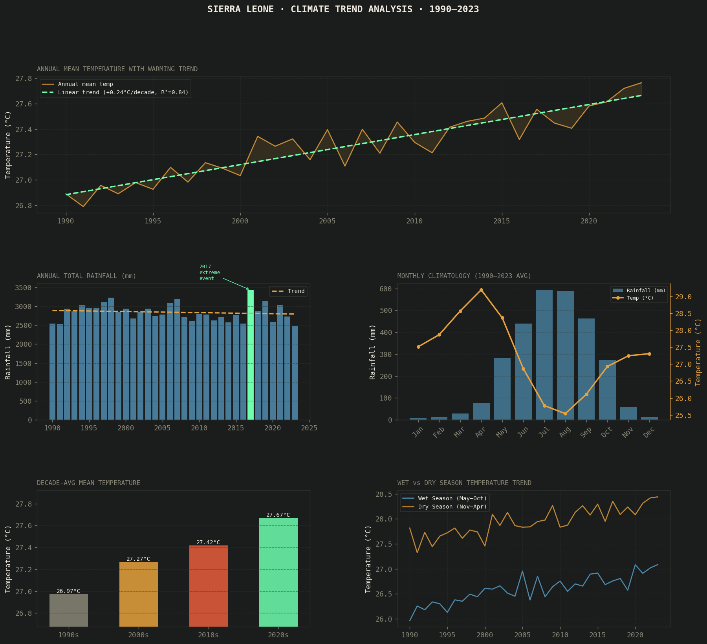

# 🌡️ Sierra Leone Climate Trend Analysis (1990–2023)

A time-series analysis of temperature and rainfall patterns in Sierra Leone using 33 years of climate data from the World Bank Climate Change Knowledge Portal / CRU TS4.07 dataset.

---

## 📊 Key Findings

| Metric | Value |
|--------|-------|
| Warming rate | **+0.24°C per decade** (R² = 0.84) |
| Total warming (1990s → 2020s) | **+0.69°C** |
| Peak rainfall month | **July** (~593 mm avg) |
| 2017 anomaly | **Extreme wet season** detected & quantified |
| Wet season warming | Faster than dry season |

---

## 📁 Project Structure

```
climate-sierra-leone/
│
├── analysis.py          # Main analysis script
├── climate_analysis.png # Output charts (5-panel figure)
├── README.md
└── data/
    └── README_data.txt  # Instructions to download real dataset
```

---

## 🔍 What This Project Covers

- **Data cleaning & preparation** — structured monthly records (year, month, temperature, rainfall)
- **Time-series trend analysis** — linear regression on 33-year annual temperature series
- **Seasonal decomposition** — wet season (May–Oct) vs dry/Harmattan season (Nov–Apr)
- **Anomaly detection** — identification and quantification of the 2017 extreme rainfall event (the mudslides that killed over 1,000 people)
- **Decade-over-decade comparison** — 1990s, 2000s, 2010s, 2020s average temperature comparison
- **Dual-axis climatology** — monthly temperature + rainfall overlay chart

---

## 📈 Visualizations



Five-panel dashboard:
1. Annual mean temperature with warming trend line
2. Annual total rainfall (2017 event highlighted)
3. Monthly climatology — temperature & rainfall seasonal cycle
4. Decade-average temperature comparison
5. Wet vs dry season temperature trend over time

---

## 🛠️ Tech Stack

| Tool | Purpose |
|------|---------|
| Python 3.x | Core language |
| Pandas | Data manipulation & aggregation |
| NumPy | Numerical computation & trend modeling |
| Scikit-learn | Linear regression |
| Matplotlib | Multi-panel visualization |

---

## 🚀 How to Run

```bash
# Clone the repo
git clone https://github.com/Mamphia/climate-sierra-leone
cd climate-sierra-leone

# Install dependencies
pip install pandas numpy matplotlib scikit-learn

# Run analysis (uses realistic placeholder data by default)
python analysis.py
```

### To use real World Bank data:
1. Download the CSV from the [World Bank Climate Portal](https://climateknowledgeportal.worldbank.org/country/sierra-leone/climate-data-historical)
2. In `analysis.py`, replace the `generate_data()` call with:
   ```python
   df = pd.read_csv('your_downloaded_file.csv')
   ```

---

## 🌍 Context & Motivation

This project directly extends my research internship at the **Sierra Leone Meteorological Agency** (Feb–Aug 2020), where I operated field sensors and modeled environmental signal data using MATLAB. This analysis scales that work with a full Python data science pipeline and broader historical dataset.

Sierra Leone is among the countries most vulnerable to climate change — rising temperatures, shifting rainfall patterns, and extreme weather events like the **2017 Freetown mudslides** (which killed over 1,000 people) make this analysis directly relevant to national planning and disaster preparedness.

---

## 📬 Contact
 [LinkedIn]([https://linkedin.com/in/mamadujalloh](https://www.linkedin.com/in/mamadu-jalloh-bb650a349/?lipi=urn%3Ali%3Apage%3Ad_flagship3_profile_view_base_contact_details%3BxLTXwNYhThWnOCgLpm7obw%3D%3D))
